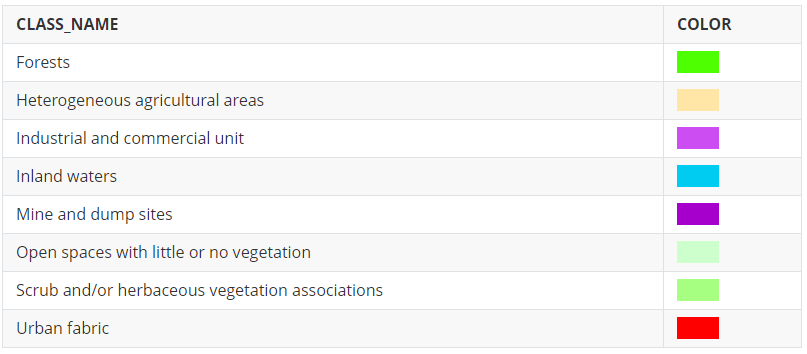

This folder contains the results in [geojson](https://geojson.org/) format  of [Landsat 8](https://www.usgs.gov/land-resources/nli/landsat/landsat-8) image classification following the [Corine Land Cove](https://land.copernicus.eu/pan-european/corine-land-cover)r schema. Features are styled according to [Mapping geoJSON files on GitHub documentation](https://help.github.com/en/github/managing-files-in-a-repository/mapping-geojson-files-on-github)

***Legend***:

